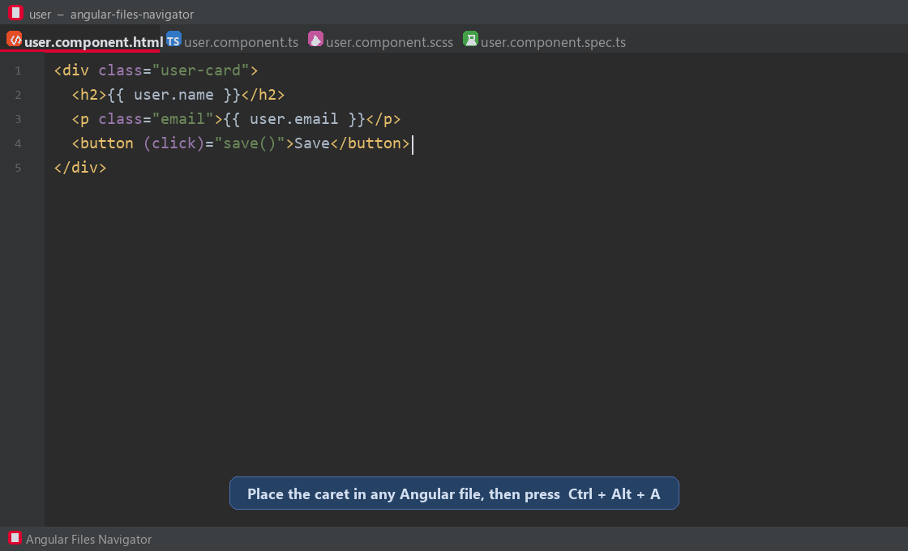

# Angular Files Navigator

This repository contains the shared Angular file-navigation experience for
IntelliJ-based IDEs and Visual Studio Code:

- `intellij/` - the IntelliJ Platform plugin, built with Gradle.
- `vscode/` - the Visual Studio Code extension, built with npm and TypeScript.

An open-source IntelliJ Platform plugin for navigating between the files that
make up an Angular component or NgRx feature.

Place the caret in any related file and press **`Ctrl+Alt+A`** to open a popup
of the files that exist for the same building block. Choose a file with its
letter mnemonic, the arrow keys, or **Enter**.



## Features

- Navigate between Angular component TypeScript, template, styles, and tests.
- Navigate between NgRx reducers, effects, selectors, actions, and facades.
- Navigate to Angular modules.
- Support classic names such as `user.component.ts` and flat names such as
  `user.ts`, `user.html`, and `user.css`.
- Search the current directory first, then find the nearest matching file in
  the project.
- Use the popup, editor and Project View context menus, or assign individual
  keybindings in **Settings -> Keymap -> Angular Files Navigator**.

## Popup shortcuts

| Key | Opens |
| --- | --- |
| `T` | Component TypeScript (`*.component.ts` or `*.ts`) |
| `H` | Component template (`*.component.html` or `*.html`) |
| `S` | Styles (`*.scss`, `*.sass`, `*.less`, or `*.css`) |
| `U` | Unit test (`*.spec.ts`) |
| `R` | NgRx reducer |
| `E` | NgRx effects |
| `L` | NgRx selectors |
| `A` | NgRx actions |
| `F` | NgRx facade |
| `M` | Angular module |

`T` and `U` are context-aware. For example, `user.selectors.spec.ts` can
toggle between the test and `user.selectors.ts`.

## Installation

### From the JetBrains Marketplace

Search for **Angular Files Navigator** in the Plugins settings of IntelliJ
IDEA, WebStorm, PhpStorm, or another compatible JetBrains IDE.

### From a ZIP

1. Download the latest ZIP from the project's Releases page.
2. Open **Settings/Preferences -> Plugins**.
3. Select the gear icon -> **Install Plugin from Disk...**.
4. Select the downloaded ZIP and restart the IDE.

## Compatibility

The plugin is built against IntelliJ Platform 2023.3 and supports IntelliJ
Platform IDEs with build `233` or newer. It uses only the platform APIs, so it
does not require the Angular or JavaScript-specific IDE plugins at runtime.

## Building from source

Requirements:

- JDK 17 or newer
- Internet access for the first Gradle dependency download

Clone the repository and build the plugin:

```bash
git clone https://github.com/vunguyen96/angular-files-navigator.git
cd angular-files-navigator
./gradlew :intellij:buildPlugin
```

The installable ZIP is generated in `intellij/build/distributions/`.

To launch a sandbox IDE with the plugin installed:

```bash
./gradlew :intellij:runIde
```

On Windows, use `gradlew.bat` instead of `./gradlew`.

If a corporate TLS proxy prevents Gradle from downloading dependencies, see
the proxy guidance in [`PUBLISHING.md`](PUBLISHING.md).

## Contributing

Contributions are welcome at
**<https://github.com/vunguyen96/angular-files-navigator>** — including bug
reports, feature ideas, documentation improvements, tests, and code changes.

Please read [`CONTRIBUTING.md`](CONTRIBUTING.md) before opening an issue or
pull request. In short:

1. Search existing issues and pull requests before starting work.
2. Fork the repository and create a focused branch.
3. Make the smallest complete change that solves the problem.
4. Run `./gradlew buildPlugin` locally.
5. Open a pull request with a clear description and testing notes.

Please follow the project's [`CODE_OF_CONDUCT.md`](CODE_OF_CONDUCT.md).
Security reports should follow [`SECURITY.md`](SECURITY.md) rather than being
posted publicly.

## Visual Studio Code

Install dependencies and compile the VS Code extension:

```bash
cd vscode
npm install
npm run compile
```

Create an installable VS Code package:

```bash
npm run package
```

This writes `vscode/angular-files-navigator-1.1.0.vsix`. Install it from the
VS Code Extensions view using **... -> Install from VSIX...**, or with:

```bash
code --install-extension angular-files-navigator-1.1.0.vsix
```

Run the extension from VS Code by opening `vscode/` and pressing `F5`.
The command **Angular Files Navigator: Related Files** is available from the
editor context menu and the Command Palette. `Ctrl+Alt+A` opens the related-file
search bar, where you can filter the recommendations and press **Enter** to
open one.

## Project structure

```text
intellij/              IntelliJ Platform module
vscode/                Visual Studio Code module
build.gradle.kts       Gradle multi-module entry point
PUBLISHING.md          Marketplace publishing instructions
```

## Publishing

Instructions for publishing releases to both the JetBrains Marketplace and the
Visual Studio Marketplace are in [`PUBLISHING.md`](PUBLISHING.md).

## License

Angular Files Navigator is available under the [MIT License](LICENSE).
